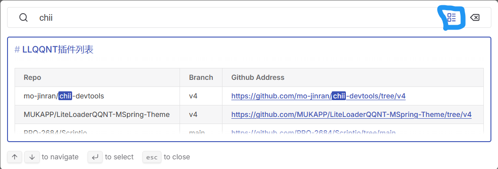

# LLQQNT插件列表

> 更新日期：2024/4/25

> 部分数据由Qwen LLM生成Markdown格式的列表和Github仓库链接，请注意鉴别！

> 底部滑动查看完整URL

> 一定要启用下图中的小标志！！！

| Repo | Branch | Github Address | 介绍 |
| --- | --- | --- | --- |
| mo-jinran/chii-devtools | v4 | <https://github.com/mo-jinran/chii-devtools/tree/v4> | 使用 Chii 进行远程调试 |
| MUKAPP/LiteLoaderQQNT-MSpring-Theme | v4 | <https://github.com/MUKAPP/LiteLoaderQQNT-MSpring-Theme/tree/v4> | LiteLoaderQQNT 主题，优雅 · 粉粉 · 细致 |
| PRO-2684/Scriptio | main | <https://github.com/PRO-2684/Scriptio/tree/main> | 自定义渲染层 JavaScript 脚本加载器 |
| PRO-2684/transitio | main | <https://github.com/PRO-2684/transitio/tree/main> | 自定义 CSS 片段加载器 |
| xiyuesaves/lite_tools | v4 | <https://github.com/xiyuesaves/lite_tools/tree/v4> | 轻量级工具箱 |
| mo-jinran/window-on-top | v4 | <https://github.com/mo-jinran/window-on-top/tree/v4> | 添加窗口置顶按钮 |
| hacker-frok/LiteLoaderQQNT-Plugin-Nostalgic | main | <https://github.com/hacker-frok/LiteLoaderQQNT-Plugin-Nostalgic/tree/main> | 让QQNT变回旧版本QQ(非NT版本)的界面布局，小面板和常规面板自动切换对应模式,让喜欢旧版QQ的朋友回味无穷(各位常觉得好用的给个star( ^_^ )). |
| xh321/LiteLoaderQQNT-Anti-Recall | master | <https://github.com/xh321/LiteLoaderQQNT-Anti-Recall/tree/master> | 防止QQNT撤回消息 |
| xh321/LiteLoaderQQNT-Media-Local-View | master | <https://github.com/xh321/LiteLoaderQQNT-Media-Local-View/tree/master> | 绕过QQ自带的媒体预览，直接用默认图片查看器或视频播放器查看图片或视频 |
| xh321/LiteLoaderQQNT-QR-Decode | master | <https://github.com/xh321/LiteLoaderQQNT-QR-Decode/tree/master> | 对聊天消息中的二维码进行解析 |
| xh321/LiteLoaderQQNT-Kill-Update | master | <https://github.com/xh321/LiteLoaderQQNT-Kill-Update/tree/master> | 彻底禁用NTQQ恼人的更新提示 |
| xh321/LiteLoaderQQNT-Directly-Jump | master | <https://github.com/xh321/LiteLoaderQQNT-Directly-Jump/tree/master> | QQNT内打开外链直接跳转，而不经过拦截页 |
| xh321/LiteLoaderQQNT-Custom-CSS | master | <https://github.com/xh321/LiteLoaderQQNT-Custom-CSS/tree/master> | 用来自定义 CSS 样式 |
| xh321/LiteLoaderQQNT-Background-Plugin | master | <https://github.com/xh321/LiteLoaderQQNT-Background-Plugin/tree/master> | 在QQNT聊天界面轮播展示背景图，同时让QQNT界面透明化以便更好地展示背景图。 |
| hacker-frok/LiteLoaderQQNT-Plugin-Brevity-btn | main | <https://github.com/hacker-frok/LiteLoaderQQNT-Plugin-Brevity-btn/tree/main> | 完全隐藏QQNT整个左边侧栏部位，并在顶部添加快速显示/隐藏按钮，带来纯纯的聊天模式. |
| MUKAPP/LiteLoaderQQNT-DeepL | main | <https://github.com/MUKAPP/LiteLoaderQQNT-DeepL/tree/main> | 将 DeepL 翻译接入你的 QQNT |
| qianxuu/LiteLoaderQQNT-Plugin-Demo-mode | main | <https://github.com/qianxuu/LiteLoaderQQNT-Plugin-Demo-mode/tree/main> | 对界面上的元素进行模糊处理以便演示或截图 |
| festoney8/LiteLoaderQQNT-Telegram-Theme | v4 | <https://github.com/festoney8/LiteLoaderQQNT-Telegram-Theme/tree/v4> | 高仿 Telegram 风格的 QQNT 主题 |
| xinyihl/LiteLoaderQQNT-JustF5 | main | <https://github.com/xinyihl/LiteLoaderQQNT-JustF5/tree/main> | 一个简单的给开发者用的功能，使用F5刷新页面无需打开调试工具刷新 |
| xtaw/LiteLoaderQQNT-Audio-Sender | master | <https://github.com/xtaw/LiteLoaderQQNT-Audio-Sender/tree/master> | 一个用于直接以语音形式发送音频文件的插件 |
| kagg886/QQRedPackGetter | master | <https://github.com/kagg886/QQRedPackGetter/tree/master> | 基于模拟点击实现的QQ抢红包工具 |
| MiyakoLol/MomoTalkNTQQ-Theme | v4 | <https://github.com/MiyakoLol/MomoTalkNTQQ-Theme/tree/v4> | 低仿 MomotalkNTQQ 风格的 QQNT 主题 |
| xtaw/LiteLoaderQQNT-Fake-Message | master | <https://github.com/xtaw/LiteLoaderQQNT-Fake-Message/tree/master> | 一个用于伪造转发聊天记录的插件 |
| mo-jinran/more-materials | main | <https://github.com/mo-jinran/more-materials/tree/main> | 添加更多的背景材质，替换原本的透明效果（Windows 11 22H2 及以上，Linux + KDE + X11） |
| ghostflyby/LiteLoaderQQNT-Native-Menu | main | <https://github.com/ghostflyby/LiteLoaderQQNT-Native-Menu/tree/main> | 为右键菜单使用原生形式，多级菜单支持需要hook-vue来运行 |
| lclichen/LiteLoaderQQNT-TTS | main | <https://github.com/lclichen/LiteLoaderQQNT-TTS/tree/main> | 可将输入字符转为语音发送。 |
| d0j1a1701/LiteLoaderQQNT-Markdown | v4 | <https://github.com/d0j1a1701/LiteLoaderQQNT-Markdown/tree/v4> | 为 QQNT 提供 Markdown 渲染 |
| MisaLiu/LiteLoaderQQNT-QQCleaner | master | <https://github.com/MisaLiu/LiteLoaderQQNT-QQCleaner/tree/master> | QQCleaner for QQNT |
| MisaLiu/LiteLoaderQQNT-Pangu | master | <https://github.com/MisaLiu/LiteLoaderQQNT-Pangu/tree/master> | · 盘古 | 开天辟地 · |
| yuyumoko/LiteLoaderQQNT-Plugin-Eencode | main | <https://github.com/yuyumoko/LiteLoaderQQNT-Plugin-Eencode/tree/main> | 文字图片消息加密~ |
| PRO-2684/LiteLoaderQQNT-pURLfy | main | <https://github.com/PRO-2684/LiteLoaderQQNT-pURLfy/tree/main> | 🧹 链接净化 |
| xtaw/LiteLoaderQQNT-Euphony | master | <https://github.com/xtaw/LiteLoaderQQNT-Euphony/tree/master> | 一个为LiteLoaderQQNT插件提供基础功能的依赖 |
| pk5ls20/LiteLoaderQQNT-NekoImageGallerySearch | main | <https://github.com/pk5ls20/LiteLoaderQQNT-NekoImageGallerySearch/tree/main> | Another web UI for NekoImageGallery, seamlessly integrated with NTQQ through LiteLoaderQQNT |
| hunyan1/LiteLoaderQQNT-Consent | master | <https://github.com/hunyan1/LiteLoaderQQNT-Consent/tree/master> | 一个自动同意好友的插件！ |
| Eticeweng/LiteLoaderQQNT-Editor-Auto-Script | main | <https://github.com/Eticeweng/LiteLoaderQQNT-Editor-Auto-Script/tree/main> | 为QQNT编辑区域添加拦截格式化字符串指令的功能，将对应匹配的指令字符串替换为对应指令的文字输出或者执行代码 |
| Eticeweng/LiteLoaderQQNT-Link-Preview | master | <https://github.com/Eticeweng/LiteLoaderQQNT-Link-Preview/tree/master> | 为聊天区域中的所有链接添加其网页标题和图标，适用于所有http或https协议的链接 |
| liaozhangsheng/LiteLoaderQQNT-Translate | master | <https://github.com/liaozhangsheng/LiteLoaderQQNT-Translate/tree/master> | 翻译 |
| Zard19991/LiteLoaderQQNT-Plugin-Plugin-Store | master | <https://github.com/Zard19991/LiteLoaderQQNT-Plugin-Plugin-Store/tree/master> | LiteLoader插件 \| 插件商店 |